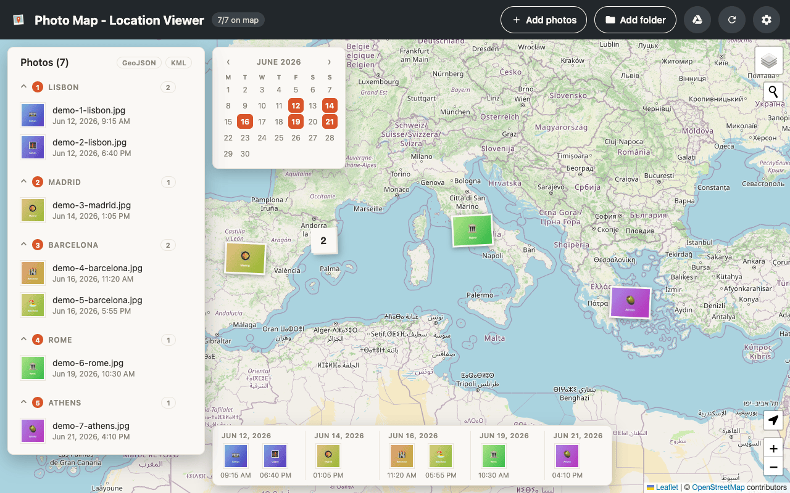

# Photo Map - Location Viewer 📍


[](https://github.com/piecioshka/photo-map-location-viewer/actions/workflows/testing.yml)
[](LICENSE)

🗺️ Drop in your photos and see where they were taken — on a map, right in your browser. No backend, no uploads: GPS coordinates are read locally from EXIF data and photos never leave your device.

**Live:** https://photo-map-location-viewer.netlify.app



## Features ✨

### Map

- 🖼️ Add multiple photos at once — each one becomes a photo-print marker on the map
- 📂 Import a whole folder in one go (the "Add folder" button) — handy on a phone, where the system photo picker makes you tap photos one by one
- 🖱️ Drag & drop photos anywhere in the window (desktop) — a drop overlay guides you; non-image files are ignored
- 🧲 Markers cluster when photos were taken close together
- 🔎 Tap a marker to see a preview, the file name, the capture date and the exact coordinates (a link to Google Maps, or the native maps app on mobile)
- 🖼️ Clicking the preview opens the untouched original photo in a new tab
- 🗺️ Three base layers (OpenStreetMap, Esri satellite, OpenTopoMap) — the choice is remembered
- 📍 Place search (Photon geocoder) and a my-location button are always available
- 📸 iPhone HEIC photos are decoded with a lazily loaded WASM decoder

### Photo list

- 🏙️ Photos are grouped by the city they were taken in, with collapsible sections
- 🔢 Each city shows a numbered badge with its order in your trip (first visit = 1)
- ✏️ City names can be renamed inline when geocoding gets them wrong
- 🕰️ Capture date and time under every photo, formatted with the date locale chosen in settings
- 🫥 Photos without GPS data land in a visible "No location" group, nothing disappears silently
- 🗑️ Every photo can be removed individually; the new-session button wipes everything

### Widgets

- 🎞️ **Timeline** — thumbnails in capture order with sticky day labels; click to jump to the photo
- 📅 **Calendar** — a month view highlighting days with photos; click a day to zoom the map to that day's shots
- 🧵 **Travel route** — a dashed line connecting photos chronologically
- 🚩 **Route view** — hides photo markers and plants one numbered flag per visited city with its photo count

### Import & export

- ☁️ Google Drive import — sign in with Google and pick a Drive folder (behind a feature flag, see setup below)
- 📤 Web Share Target — share photos from the phone gallery straight into the installed PWA
- 🌐 Export the trip as GeoJSON or KML (points + chronological route)
- 🧪 "Try with sample photos" on the empty state renders a demo trip entirely in the browser

### Settings (gear in the top bar, with the app version at the bottom)

- 🌓 **Appearance** — dark theme (map tiles included; satellite stays untouched), accent color, date format and interface language (EN/PL)
- 🛤️ **Map** — travel route and route view toggles
- 🧩 **Widgets** — visibility of the photo list, timeline and calendar
- 💽 **Storage** — keep or skip original files; the app asks for persistent storage and warns when the quota runs low

### Persistence & privacy

- 💾 Photo metadata lives in `localStorage`, thumbnails/previews/originals in IndexedDB — a reload restores your whole session
- ⏳ A loader in the top bar shows progress while photos are processed or restored
- 🔒 A privacy dialog spells out exactly what stays local and what leaves the device
- 🍪 A cookie banner asks before any analytics loads — reject it and Google Analytics is never fetched; preferences can be changed later from the privacy dialog

## How it works 🔍

1. You pick photos with the file input or drag & drop them onto the map (nothing is uploaded anywhere)
2. [exifr](https://github.com/MikeKovarik/exifr) reads the EXIF GPS block and capture date locally
3. [Leaflet](https://leafletjs.com) renders the markers, clustered by [leaflet.markercluster](https://github.com/Leaflet/Leaflet.markercluster); [leaflet-control-geocoder](https://github.com/perliedman/leaflet-control-geocoder) powers place search and [leaflet.locatecontrol](https://github.com/domoritz/leaflet-locatecontrol) the my-location button
4. City names come from the free [BigDataCloud reverse-geocoding API](https://www.bigdatacloud.com/free-api/free-reverse-geocode-to-city-api) — **only coordinates are sent, never photos** — throttled and cached per ~1 km, with results stored locally so they are looked up once

> [!NOTE]
> Screenshots, images shared via messaging apps and photos taken with camera
> location access turned off have no GPS data — those show up in the
> "No location" group.

> [!WARNING]
> iOS Safari converts HEIC to JPEG when picking photos from the gallery and
> may strip location data for privacy. If your photos show up without
> location, try picking them via the Files app.

## Storage 💾

Everything stays in your browser, under a common `photo-map` prefix:

| Where        | Key                      | What                                          |
| ------------ | ------------------------ | --------------------------------------------- |
| localStorage | `photo-map:photos`       | photo metadata (name, GPS, date, city)        |
| localStorage | `photo-map:features`     | settings toggles                              |
| localStorage | `photo-map:accent-color` | accent color                                  |
| localStorage | `photo-map:date-locale`  | date format locale                            |
| localStorage | `photo-map:language`     | interface language                            |
| localStorage | `photo-map:layer`        | chosen base layer                             |
| IndexedDB    | `photo-map` database     | thumbnails, previews and original photo blobs |
| cookie       | `cc_cookie`              | your cookie-consent choice                    |

The app is an installable PWA — a custom Workbox service worker precaches the app shell (offline start) and handles the Web Share Target; map tiles and city lookups still need network.

## Google Drive setup 🔑

The Google Drive import runs fully in the browser (OAuth token flow +
Drive REST API, `drive.readonly` scope) and only needs an OAuth Client ID —
no API key, no backend:

1. In [Google Cloud Console](https://console.cloud.google.com) create (or pick) a project and enable the **Google Drive API**
2. Configure the OAuth consent screen (External is fine; while the app is in "Testing" add yourself as a test user)
3. Create **Credentials → OAuth Client ID → Web application** and add your site's address (e.g. `http://localhost:3000` for development) to **Authorized JavaScript origins**
4. Set the `VITE_GOOGLE_CLIENT_ID` environment variable at build time (`.env.local` for development, Netlify build environment for production) — without it the Drive button is hidden
5. Enable the feature flag with `VITE_FF_GOOGLE_DRIVE=true` (or append `?ff=googleDrive` to the URL for a one-off try)

Photos are downloaded from Drive directly into the browser and never sent
anywhere else.

## Feature flags 🚩

Work in progress hides behind flags in
[`src/services/feature-flags.ts`](src/services/feature-flags.ts). Each flag
is off unless its `VITE_FF_*` variable is set at build time:

| Flag          | Variable               | Controls                       |
| ------------- | ---------------------- | ------------------------------ |
| `googleDrive` | `VITE_FF_GOOGLE_DRIVE` | the Google Drive import button |

A `?ff=` query parameter overrides the built-in default for one visit, so a
flag can be tried on a real deploy without rebuilding:

```
/?ff=googleDrive     # turn it on
/?ff=-googleDrive    # turn it off
/?ff=a,-b            # several at once
```

Flagged features are imported lazily, so a disabled one ships no code to the
browser at all.

## Development 🛠️

```bash
npm install
npm run dev        # dev server (first free port from 3000)
npm run lint       # ESLint (type assertions are banned)
npm test           # unit tests (Vitest)
npm run test:e2e   # end-to-end tests (Playwright)
npm run build      # typecheck + production build to dist/
npm run preview    # serve the production build
```

CI (GitHub Actions) runs Prettier, ESLint, unit tests, the build and the
Playwright suite on every push; green `main` deploys to Netlify (set the
`NETLIFY_AUTH_TOKEN` secret and the `VITE_*` repository variables). A
pre-commit hook lints and formats staged files.

See [CONTRIBUTING.md](CONTRIBUTING.md) for the module layout and house rules.

## Deploy 🚀

Static hosting on Netlify (https://photo-map-location-viewer.netlify.app) — `netlify.toml` builds with `npm run build` and publishes `dist/`.

## License 📄

[The MIT License](https://piecioshka.mit-license.org) @ 2026
